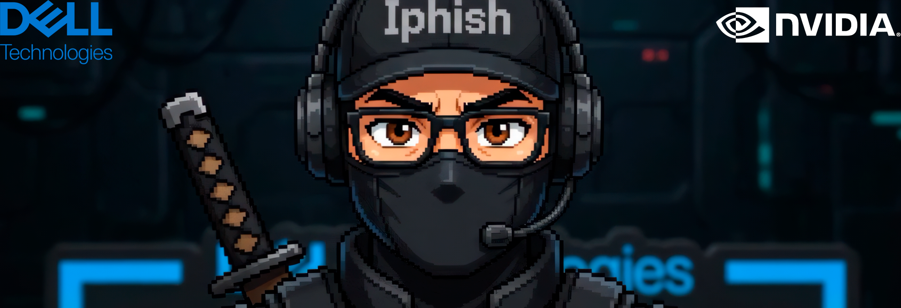

# iPhish Agent

<div align="center">
  
</div>

## ABOUT
**iPhish Agent** is a local, Hermes-powered AI agent for authorized phishing-awareness simulations. It is packaged as an **NVIDIA AI Workbench** project for **Dell Pro Max with GB10** and built around **NVIDIA NemoClaw**, the open-source reference stack that installs the **OpenShell** secure runtime, so the agent can help security teams without ever running freely across the environment.

Everything runs on local, open-weight models with no cloud LLM and no data leaving the box. A security specialist describes an authorized scenario in plain language, and the agent prepares the GoPhish campaign, routes every message to a Mailpit review inbox first, and generates campaign-safe visuals locally with ComfyUI. Nothing reaches a real recipient without human approval.

Contest video: [YouTube](https://youtu.be/KvAol_3f6ko?si=Mz0tblg5yqnA8uhO)

[](LICENSE)


<div align="center">
  <a href="https://youtu.be/KvAol_3f6ko?si=Mz0tblg5yqnA8uhO">
    
  </a>
</div>

## THE SECURITY PROBLEM

Phishing is still the way most breaches begin. Attackers do not stand still they iterate constantly, launch new attacks faster than teams can react, and operate freely because it works. It remains one of the cheapest, most effective ways into an enterprise, and no firewall patches human trust.

The defensive answer already exists. Regular, realistic awareness simulations are proven to train people to recognize and resist these attacks. But running them well is hard... campaign copy, landing pages, SMTP routing, visual assets, recipient scoping and approvals usually fall on one specialist wiring several tools by hand. That technical friction is the real bottleneck. It makes enterprises run fewer exercises, and rushed ones can turn unsafe.

**iPhish Agent** removes that friction so defense can keep pace with the threat. A technical user describes an authorized scenario in plain language, and the agent prepares the GoPhish artifacts, the Mailpit review flow and the ComfyUI assets, with every dangerous step bounded and human-approved. The technical complexity disappears into the tool. What is left is a defender who can run more simulations, more often, without ever losing control of what the agent is allowed to do.

## WHAT IT DOES


- Runs entirely on Local: OpenAI-compatible vLLM endpoint, never a cloud LLM, so no target data ever leaves the box.
- Cloneable NVIDIA AI Workbench project, fully reproducible on a Dell Pro Max with GB10 and other AI Workstations.
- Gives the operator a Hermes dashboard to drive the whole campaign in natural language.
- Builds review-first GoPhish campaigns (templates, groups, SMTP profiles and landing pages) through a single controlled local skill.
- Routes every message to Mailpit first, so nothing reaches a real inbox until a human approves it.
- Generates campaign-safe visuals locally with ComfyUI and Z-Image-Turbo, no stock assets, no external calls.
- Enforces an OpenShell policy template that fences the agent to expected local services and the configured model endpoint, so it cannot run wild.
- Keeps runtime state, model weights, databases, logs and secrets out of Git by design.

## ARCHITECTURE


The whole system runs as one NVIDIA AI Workbench project on the Dell Pro Max with GB10, exposing four apps that map cleanly to the workflow: one to drive it, one to build campaigns, one to review them, and one to generate assets.

| App         | Role in the workflow                                                          |
| ----------- | ----------------------------------------------------------------------------- |
| **Iphish**  | The Hermes dashboard. The operator's natural-language cockpit for the demo.   |
| **GoPhish** | Builds the campaign objects: templates, groups, SMTP profiles, landing pages. |
| **Mailpit** | The review-only inbox and SMTP sink that catches everything before delivery.  |
| **ComfyUI** | Local image generation through the bundled Z-Image-Turbo workflow.            |

The project container uses the host Docker socket to launch these service containers right next to the Workbench project. That choice keeps the demo compact and repeatable on a single Dell Pro Max with GB10, which matters when a judge has to recreate it from scratch. It also carries real privilege, so it is meant only for a trusted local lab or workstation, never an exposed environment. The full reasoning and the hardening notes live in [SECURITY.md](https://github.com/MangelZabalaDevelop/iPhish-Agent/blob/main/SECURITY.md).

## SAFETY MODEL

For a phishing tool, safety is not a feature. It is the whole point. **iPhish Agent** is built for authorized internal awareness simulations only, and every layer is designed so the agent stays inside the lines even when asked to do more.

- **Operator-scoped targets.** The agent only touches recipients the operator explicitly provides. It never sources or expands its own target list.
- **No credential harvesting.** It never collects passwords, MFA codes, tokens, payment data or secrets. The goal is awareness, not compromise.
- **Mailpit first, always.** Every message lands in a local review inbox before any real SMTP path is possible, so nothing reaches a person by accident.
- **Human approval to send.** Final delivery requires a person to sign off. The agent prepares, the operator decides.
- **OpenShell boundaries.** A policy template fences the agent to expected local services and the configured model endpoint, so it cannot reach out anywhere it was not meant to go.
- **Contained state.** All generated media and campaign data stay inside ignored data/ paths, never committed, never leaked.
- **Review-gated visuals.** No text baked into images, no unreviewed assets in campaigns. Every generated visual passes through human review.

The core safety behavior is encoded in
[`skills/security/controlled-gophish-campaign/SKILL.md`](skills/security/controlled-gophish-campaign/SKILL.md).

## SETUP

1. Install NVIDIA AI Workbench.
2. Open AI Workbench and select the Dell Pro Max with GB10 location.
3. Select **Clone Project**.
4. Use this Git repository URL:

```text
https://github.com/MangelZabalaDevelop/iPhish-Agent.git
```

5. Build the **Project Container**.
6. Configure the host Docker socket mount. In CLI form:

```bash
nvwb configure mounts /var/run/:/host-run/ -c local -p /absolute/path/to/iPhish-Agent
```

In NVIDIA AI Workbench, use the cloned project folder shown in the project details; if you open a Workbench terminal from that project, replace `/absolute/path/to/iPhish-Agent` with `$(pwd)`.

In the Workbench UI, configure the host mount target `/host-run/` to use the
host source directory `/var/run/`.

7. Configure the local model endpoint in Workbench environment variables:

```text
HERMES_MODEL=Qwen3.6-35B-A3B-NVFP4
HERMES_BASE_URL=http://127.0.0.1:9494
```

If your vLLM server is reachable from the Workbench project through another
local or LAN address, set `HERMES_BASE_URL` to that OpenAI-compatible endpoint.
The script normalizes the URL to `/v1` automatically.

8. Start **Iphish** from the Workbench apps list.

The **Iphish** app starts Hermes, GoPhish, Mailpit and the Workbench routes. It
opens directly into the Hermes dashboard; there is no Hermes username or
password in this Workbench setup.

Start **ComfyUI** only when you need local image generation. The first ComfyUI
start may take a while because it builds the local GB10 ComfyUI image if it is
missing and downloads the Z-Image-Turbo model files into ignored local storage.

Default local GoPhish admin login:

```text
Username: admin
Password: Iphish123!
```

For shared or exposed environments, override the GoPhish admin password hash and
do not use the demo password.


## CONFIGURATION

Public defaults match the contest demo model:

```text
HERMES_MODEL=Qwen3.6-35B-A3B-NVFP4
HERMES_BASE_URL=http://127.0.0.1:9494
```

Useful optional variables:

| Variable | Meaning |
| --- | --- |
| `HERMES_BASE_URL_CANDIDATES` | Space-separated fallback model endpoints. |
| `HERMES_API_KEY` | API key for the local OpenAI-compatible endpoint, if required. |
| `GOPHISH_IMAGE` | GoPhish container image. Defaults to a public multi-architecture image. |
| `GOPHISH_ADMIN_PASSWORD_HASH` | Bcrypt hash for the GoPhish admin password. |
| `COMFYUI_IMAGE` | Local ComfyUI image name. Defaults to `iphish-comfyui:gb10`. |
| `COMFYUI_IMAGE_AUTO_BUILD` | Build the local ComfyUI image on first start when it is missing. Defaults to `1`. |
| `WORKBENCH_APP_BASE_URL` | Workbench proxy base URL for app links. |
| `PROJECT_HOST_DIR` | Explicit host path for advanced Workbench/Docker setups. |

Runtime secrets such as `GOPHISH_API_KEY` and `HERMES_API_SERVER_KEY` are
generated into ignored local state under `data/scratch/secrets/`.

## DOCUMENTS FOR SUBMISSION

- [One-pager](docs/one-pager.md)
- [Technical installation guide](docs/technical-installation.md)
- [Software and models inventory](docs/software-models-inventory.md)
- [OpenShell policy template](policies/openshell-policy.example.yaml)

## REFERENCES

- Dell product page for [Dell Pro Max with GB10](https://www.dell.com/en-us/shop/desktop-computers/dell-pro-max-with-gb10/spd/dell-pro-max-fcm1253-micro)
- NVIDIA AI Workbench [Project Specification](https://docs.nvidia.com/ai-workbench/user-guide/latest/reference/projects/spec.html)
- NVIDIA AI Workbench [Clone a Git repository](https://docs.nvidia.com/ai-workbench/user-guide/latest/how-to/convert-repo.html)

## LICENSE

MIT. See [LICENSE](LICENSE).
