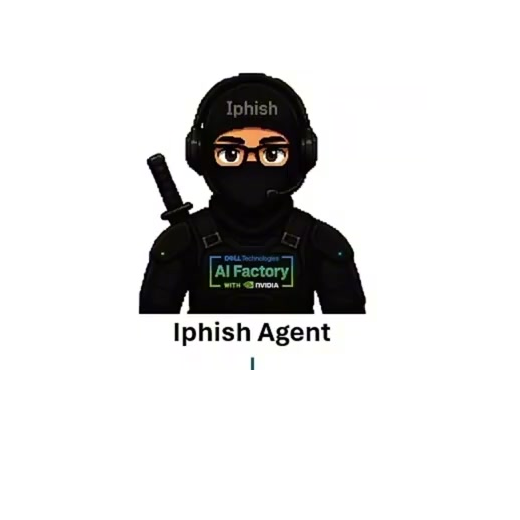
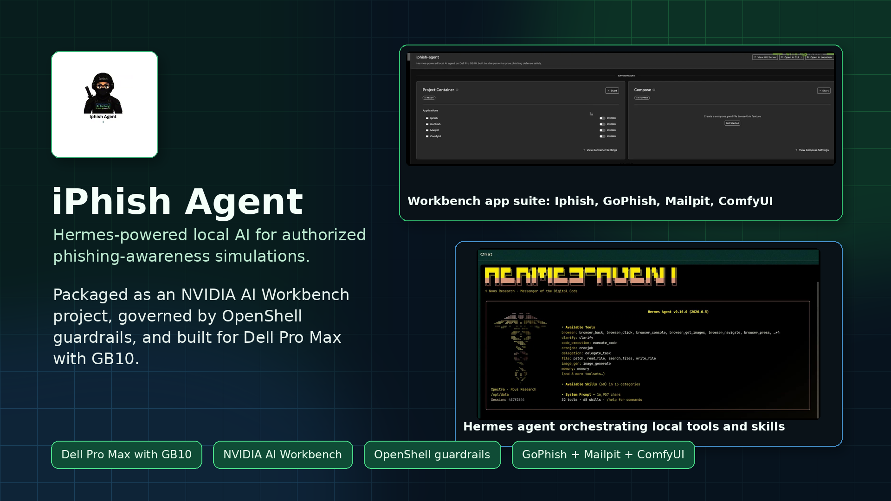
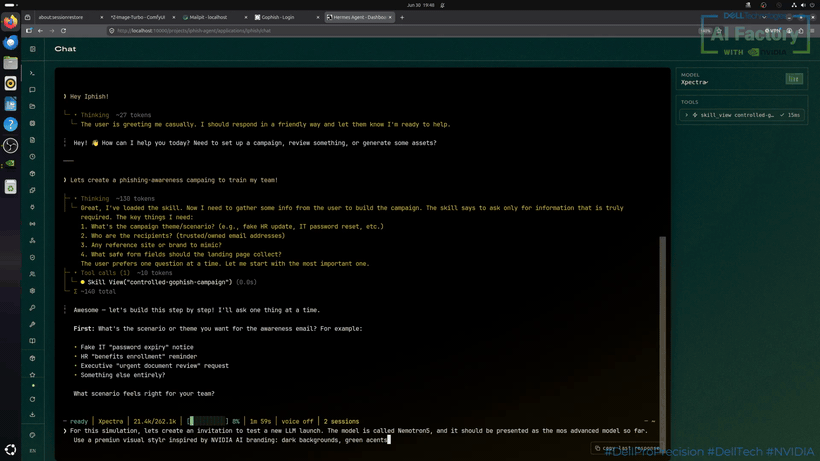
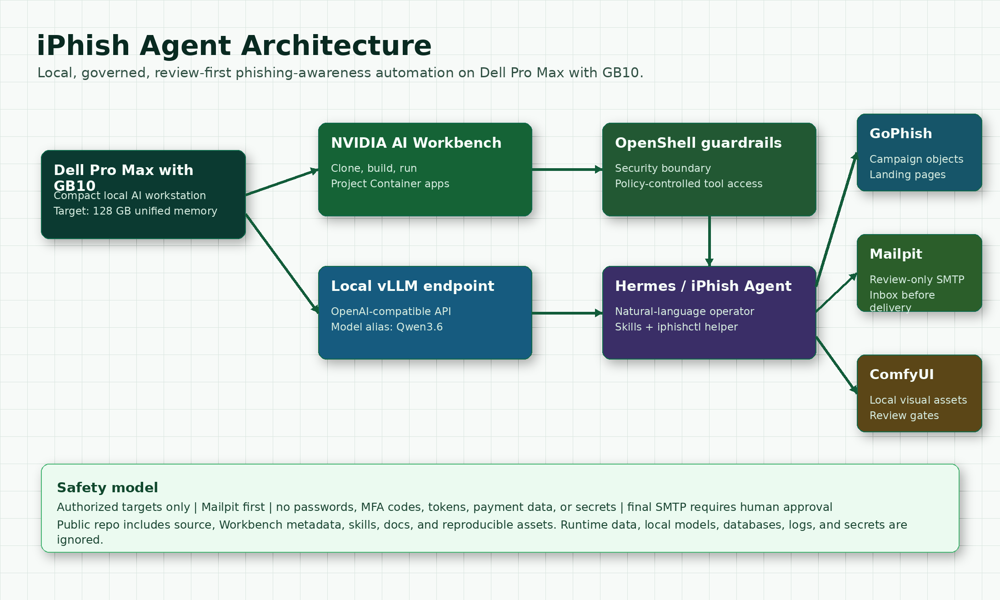

# iPhish Agent

<div align="center">
  
</div>

## ABOUT

**iPhish Agent** is a local, Hermes-powered AI agent for authorized
phishing-awareness simulations. It is packaged as an **NVIDIA AI Workbench**
project for **Dell Pro Max with GB10** and designed around an OpenShell
guardrail model so the agent can help security teams without running freely
across the environment.

Contest video: [YouTube](https://youtu.be/KvAol_3f6ko?si=Mz0tblg5yqnA8uhO)

[](LICENSE)


<div align="center">
  <a href="https://youtu.be/KvAol_3f6ko?si=Mz0tblg5yqnA8uhO">
    
  </a>
</div>

## THE SECURITY PROBLEM

Phishing-awareness programs are valuable, but the operational workflow is still
slow and risky: campaign copy, landing pages, SMTP routing, visual assets,
recipient scoping, and approvals often depend on a specialist wiring several
tools by hand. That technical friction makes enterprises run fewer exercises,
and rushed simulations can accidentally become unsafe.

**iPhish Agent** turns that workflow into a controlled local assistant. A
security consultant can describe an authorized awareness scenario in natural
language, and the agent prepares the GoPhish objects, Mailpit review flow, and
optional ComfyUI assets while keeping the dangerous parts bounded.

## WHAT IT DOES



- Runs as a cloneable NVIDIA AI Workbench project.
- Uses a local OpenAI-compatible vLLM endpoint, not a cloud LLM.
- Provides a Hermes dashboard as the primary operator interface.
- Creates review-first GoPhish campaigns through a controlled local skill.
- Sends all review email to Mailpit before any real SMTP delivery.
- Uses ComfyUI and Z-Image-Turbo for local campaign-safe image generation.
- Publishes an OpenShell policy template that limits the agent to expected local
  services and the configured model endpoint.
- Keeps runtime state, local models, databases, logs, and generated secrets out
  of Git.

## ARCHITECTURE



The Workbench project exposes four apps:

| App | Purpose |
| --- | --- |
| **Iphish** | Hermes dashboard and natural-language operator interface. |
| **GoPhish** | Local campaign, template, group, SMTP, and landing-page objects. |
| **Mailpit** | Review-only inbox and SMTP sink before delivery approval. |
| **ComfyUI** | Local image generation through the bundled Z-Image-Turbo workflow. |

The project container uses the host Docker socket to launch service containers
next to the Workbench project. That design keeps the demo compact and
repeatable on a Dell Pro Max with GB10, but it should only be used in a trusted
local lab or workstation context. See [SECURITY.md](SECURITY.md).

## SAFETY MODEL

iPhish Agent is for **authorized internal awareness simulations only**.

- Use only targets explicitly provided by the operator.
- Do not collect passwords, MFA codes, tokens, payment data, or secrets.
- Use Mailpit as the first SMTP destination.
- Require human approval before final SMTP delivery.
- Use OpenShell policy boundaries for expected local endpoints.
- Keep generated media and campaign state inside ignored `data/` paths.
- Treat image generation as review-gated: no text in images and no unreviewed
  visual assets in campaigns.

The core safety behavior is encoded in
[`skills/security/controlled-gophish-campaign/SKILL.md`](skills/security/controlled-gophish-campaign/SKILL.md).

## QUICK START WITH NVIDIA AI WORKBENCH

1. Install NVIDIA AI Workbench.
2. Open AI Workbench and select the Dell Pro Max with GB10 location.
3. Select **Clone Project**.
4. Use this Git repository URL:

```text
https://github.com/MangelZabalaDevelop/iPhish-Agent.git
```

5. Build the **Project Container**.
6. Configure the host Docker socket mount. In CLI form:

```bash
nvwb configure mounts /var/run/:/host-run/ -c local -p /absolute/path/to/iPhish-Agent
```

In the Workbench UI, configure the host mount target `/host-run/` to use the
host source directory `/var/run/`.

7. Configure the local model endpoint in Workbench environment variables:

```text
HERMES_MODEL=Qwen3.6
HERMES_BASE_URL=http://127.0.0.1:9494
```

If your vLLM server is reachable from the Workbench project through another
local or LAN address, set `HERMES_BASE_URL` to that OpenAI-compatible endpoint.
The script normalizes the URL to `/v1` automatically.

8. Start the Workbench apps:

- **Iphish**
- **GoPhish**
- **Mailpit**
- **ComfyUI** when image generation is needed

Default local GoPhish admin login:

```text
Username: admin
Password: Iphish123!
```

For shared or exposed environments, override the GoPhish admin password hash and
do not use the demo password.

## LOCAL VALIDATION

From a normal shell:

```bash
git clone https://github.com/MangelZabalaDevelop/iPhish-Agent.git
cd iPhish-Agent
nvwb validate project-spec
bash -n scripts/hermes_workbench.sh preBuild.bash postBuild.bash
python3 -m py_compile scripts/gophish_workbench_proxy.py
```

The Workbench app start sequence expects Docker access from the project
container and a reachable local model endpoint.

## CONFIGURATION

Public defaults are intentionally generic:

```text
HERMES_MODEL=Qwen3.6
HERMES_BASE_URL=http://127.0.0.1:9494
```

Useful optional variables:

| Variable | Meaning |
| --- | --- |
| `HERMES_BASE_URL_CANDIDATES` | Space-separated fallback model endpoints. |
| `HERMES_API_KEY` | API key for the local OpenAI-compatible endpoint, if required. |
| `GOPHISH_ADMIN_PASSWORD_HASH` | Bcrypt hash for the GoPhish admin password. |
| `WORKBENCH_APP_BASE_URL` | Workbench proxy base URL for app links. |
| `PROJECT_HOST_DIR` | Explicit host path for advanced Workbench/Docker setups. |

Runtime secrets such as `GOPHISH_API_KEY` and `HERMES_API_SERVER_KEY` are
generated into ignored local state under `data/scratch/secrets/`.

## DOCUMENTS FOR SUBMISSION

- [One-pager](docs/one-pager.md)
- [Technical installation guide](docs/technical-installation.md)
- [Software and models inventory](docs/software-models-inventory.md)
- [Demo script](docs/demo-script.md)
- [Submission checklist](docs/submission-checklist.md)
- [OpenShell policy template](policies/openshell-policy.example.yaml)

## PUBLIC REPOSITORY SCOPE

This repository contains source code, Workbench project metadata, skills,
documentation, screenshots, a short demo GIF, and policy examples.

It does **not** contain runtime databases, local model weights, generated
campaign data, logs, `.env` files, or generated secrets.

## REFERENCES

- Dell product page for [Dell Pro Max with GB10](https://www.dell.com/en-us/shop/desktop-computers/dell-pro-max-with-gb10/spd/dell-pro-max-fcm1253-micro)
- NVIDIA AI Workbench [Project Specification](https://docs.nvidia.com/ai-workbench/user-guide/latest/reference/projects/spec.html)
- NVIDIA AI Workbench [Clone a Git repository](https://docs.nvidia.com/ai-workbench/user-guide/latest/how-to/convert-repo.html)

## LICENSE

MIT. See [LICENSE](LICENSE).
